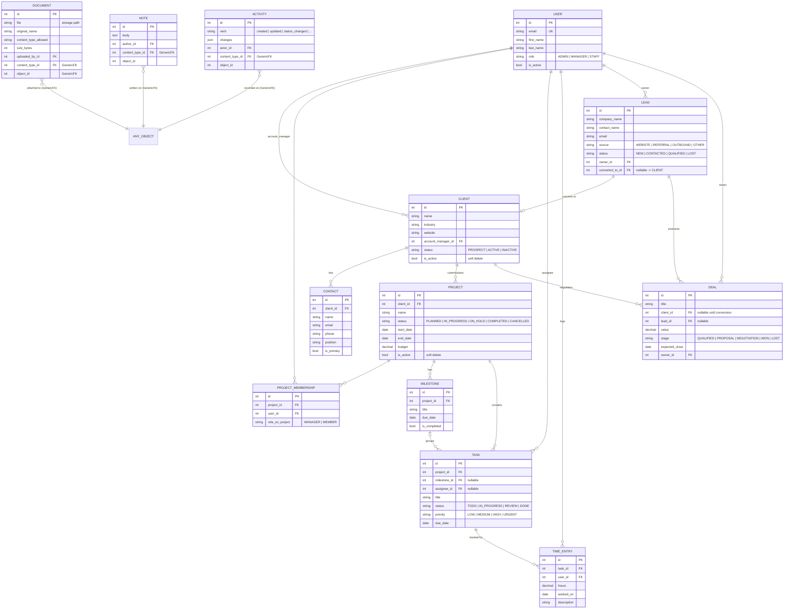
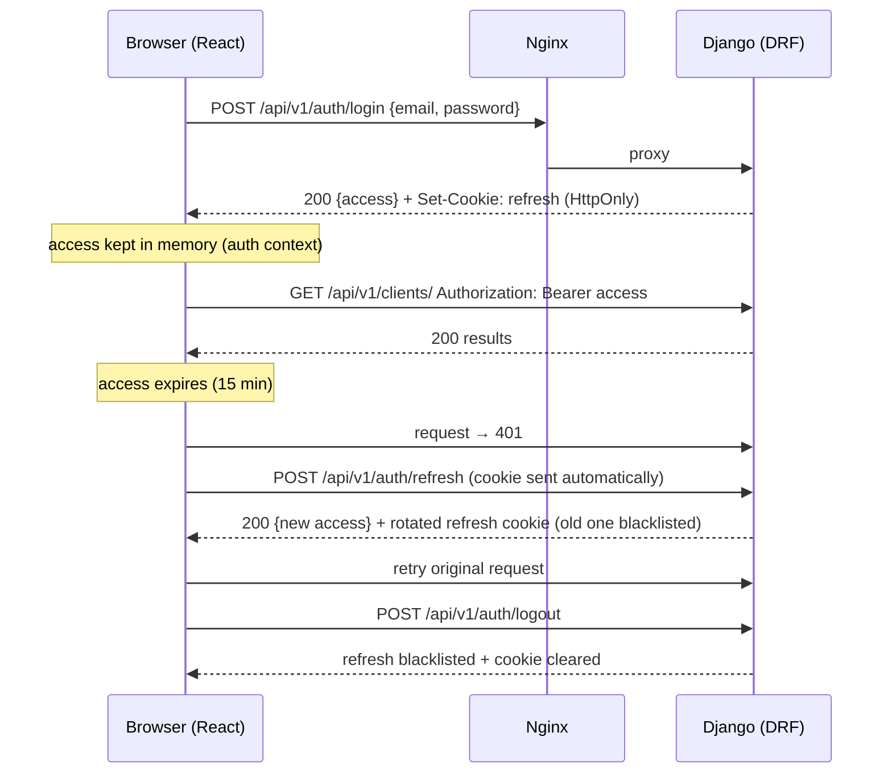

# ClientHub CRM — Software Architecture

**Client & Project Management System for IT Service Companies**

| | |
|---|---|
| Frontend | React 18 + Vite + Tailwind CSS |
| Backend | Django 5 + Django REST Framework |
| Database | PostgreSQL 16 |
| Auth | JWT (djangorestframework-simplejwt) |
| Infra | Docker, docker-compose, Nginx, Gunicorn |
| API style | REST, versioned (`/api/v1/`), OpenAPI schema via drf-spectacular |

This document is the single source of truth for structure, conventions, and the build plan. **No code exists yet** — everything below is the contract we build against.

---

## 1. Repository & Folder Structure

Monorepo with two deployable units (`backend`, `frontend`) plus infrastructure:

```
ClientHub/
├── ARCHITECTURE.md
├── README.md
├── .env.example                  # every env var documented, no secrets
├── .gitignore
├── docker-compose.yml            # dev: db + backend (runserver) + frontend (vite)
├── docker-compose.prod.yml       # prod: db + gunicorn + nginx + built frontend
│
├── backend/
│   ├── Dockerfile
│   ├── requirements/
│   │   ├── base.txt              # django, drf, simplejwt, psycopg, drf-spectacular…
│   │   ├── dev.txt               # + pytest-django, factory-boy, ruff, django-debug-toolbar
│   │   └── prod.txt              # + gunicorn, django-storages (if S3), sentry-sdk
│   ├── manage.py
│   ├── config/                   # the Django "project" — settings & wiring only
│   │   ├── __init__.py
│   │   ├── settings/
│   │   │   ├── base.py
│   │   │   ├── dev.py
│   │   │   └── prod.py
│   │   ├── urls.py               # mounts /api/v1/, /admin/, schema/docs
│   │   ├── wsgi.py
│   │   └── asgi.py
│   ├── apps/                     # all business apps live here (see §2)
│   │   ├── core/
│   │   ├── accounts/
│   │   ├── clients/
│   │   ├── sales/
│   │   ├── projects/
│   │   ├── documents/
│   │   ├── activities/
│   │   └── billing/              # phase 2
│   ├── media/                    # dev-only uploads (gitignored)
│   └── tests/                    # cross-app integration tests; unit tests live per-app
│
├── frontend/
│   ├── Dockerfile
│   ├── index.html
│   ├── package.json
│   ├── tailwind.config.js
│   ├── vite.config.js
│   └── src/                      # see §3
│
└── nginx/
    ├── nginx.conf                # reverse proxy, static/media, gzip, security headers
    └── Dockerfile
```

**Rules:**
- `config/` contains **zero business logic** — settings, root URLconf, WSGI only.
- Split settings (`base/dev/prod`) selected via `DJANGO_SETTINGS_MODULE`. All secrets/environment differences come from env vars (12-factor); `.env.example` is always up to date.
- Each Django app is self-contained: its own `models.py`, `serializers.py`, `views.py`, `urls.py`, `permissions.py`, `filters.py`, `tests/`.

---

## 2. Django Apps

Apps are split by **business domain**, not by technical layer. Each owns its tables, its API slice, and its permission rules.

| App | Responsibility | Key models |
|---|---|---|
| `core` | Shared plumbing: `TimeStampedModel` (created_at/updated_at), soft-delete mixin, base permission classes, pagination class, exception handler, common validators. **No API endpoints, no migrations of its own** (abstract models only). | — |
| `accounts` | Custom `User` (email login), roles, JWT endpoints (login/refresh/logout), profile, password change. | `User` |
| `clients` | Client companies and the people at them. | `Client`, `Contact` |
| `sales` | Pre-client pipeline: leads and deals with stages; lead → client conversion. | `Lead`, `Deal` |
| `projects` | Delivery: projects for clients, milestones, tasks, assignments, time tracking. | `Project`, `Milestone`, `Task`, `TimeEntry` |
| `documents` | File attachments to any object (client, project, task, deal). Upload/validation/download rules — see §9. | `Document` |
| `activities` | Notes and the auto-generated activity timeline ("X changed status of Task Y"). Attachable to any object. | `Note`, `Activity` |
| `billing` *(phase 2)* | Invoices generated from projects/time entries, payment status. | `Invoice`, `InvoiceItem`, `Payment` |

**Why a custom User from day one:** swapping the user model after the first migration is the most painful change in Django. `accounts.User` (email as username, `role` field) is created **before** the initial migrate.

**Why `sales` is separate from `clients`:** leads are unqualified and get deleted/lost in bulk; clients are permanent records with delivery history. Different lifecycles, different permissions.

---

## 3. React Folder Structure

Feature-based (mirrors the Django apps), with a thin shared layer. Server state is handled by **TanStack Query**; auth state by a small context. No Redux — this app's client-side state doesn't justify it.

```
frontend/src/
├── main.jsx
├── App.jsx                       # router + providers (QueryClient, AuthProvider)
├── api/
│   ├── client.js                 # axios instance: baseURL /api/v1, auth interceptors (§7)
│   └── endpoints/                # one file per backend app: clients.js, projects.js…
├── features/                     # one folder per domain, mirrors Django apps
│   ├── auth/                     # LoginPage, useAuth, ProtectedRoute, RoleGate
│   ├── dashboard/
│   ├── clients/
│   │   ├── components/           # ClientTable, ClientForm, ClientDetailTabs…
│   │   ├── hooks/                # useClients, useClient (TanStack Query wrappers)
│   │   └── pages/                # ClientListPage, ClientDetailPage
│   ├── sales/
│   ├── projects/                 # incl. TaskBoard (kanban), TaskModal
│   ├── documents/                # FileUploader, DocumentList
│   └── activities/               # NoteComposer, ActivityTimeline
├── components/                   # truly generic, domain-free UI
│   ├── ui/                       # Button, Input, Select, Modal, Badge, Table, Spinner
│   └── layout/                   # AppShell, Sidebar, Topbar, PageHeader
├── hooks/                        # generic hooks: useDebounce, usePagination, useDisclosure
├── lib/                          # formatters (date, currency), constants, role helpers
└── styles/                       # tailwind entry css, theme tokens
```

**Rules:**
- A `features/x` folder may import from `components/`, `hooks/`, `lib/`, `api/` — **never from another feature**. Cross-feature needs promote the piece into `components/` or `lib/`.
- Pages compose components; components never fetch — data fetching lives in the feature's `hooks/` via TanStack Query, so caching/invalidation is centralized.
- Routing: React Router; route tree defined in `App.jsx`; every non-auth route wrapped in `ProtectedRoute`, role-restricted UI wrapped in `RoleGate`.

---

## 4. Database Relationships

All models inherit `TimeStampedModel`. Business records that must survive "delete" for audit reasons (`Client`, `Project`) use soft delete (`is_active` flag); operational rows (`Task`, `Note`) hard-delete.

| Relationship | Type | Notes |
|---|---|---|
| User → Client (`account_manager`) | 1 → N | `on_delete=PROTECT` — can't delete a user who owns clients |
| Client → Contact | 1 → N | CASCADE; a contact can be `is_primary` (one per client, enforced in DB constraint) |
| Client → Project | 1 → N | PROTECT on client |
| User ↔ Project (`members`) | M ↔ N | through table `ProjectMembership` (role-on-project, joined date) |
| Project → Milestone | 1 → N | CASCADE |
| Project → Task | 1 → N | CASCADE; `Task.milestone` optional FK (SET_NULL) |
| User → Task (`assignee`) | 1 → N | SET_NULL — unassigned tasks are valid |
| Task → TimeEntry ← User | 1 → N ← 1 | who logged how long on what |
| Lead → Deal | 1 → N | a lead can produce deals; Deal also FKs Client once converted |
| Lead → Client (`converted_to`) | 1 → 0..1 | set on conversion, keeps the funnel auditable |
| Document → any object | GenericFK | `content_type` + `object_id` — one attachment system for all |
| Note / Activity → any object | GenericFK | same pattern; `Activity` rows are system-generated, append-only |

**Choice pattern:** all enumerations (`Task.status`, `Deal.stage`, `User.role`, `Lead.source`…) are `TextChoices` in code, **not** lookup tables — they change with releases, not by admin users. If a customer needs custom pipeline stages later, promote `Deal.stage` to a table then.

**Indexes:** FK columns (automatic), plus composite indexes on the hot list-screen filters: `Task(project, status)`, `Deal(stage, owner)`, `Activity(content_type, object_id, -created_at)`.

---

## 5. Entity Relationship Diagram



*(Phase 2 adds `INVOICE` ||--o{ `INVOICE_ITEM`, `INVOICE` }o--|| `CLIENT`, `INVOICE` }o--o| `PROJECT`, `PAYMENT` }o--|| `INVOICE`.)*

---

## 6. API Architecture

**Style:** resource-oriented REST under `/api/v1/`. DRF `ModelViewSet` + routers; version in the URL so v2 can coexist later.

```
/api/v1/auth/login/            POST    → access + refresh
/api/v1/auth/refresh/          POST
/api/v1/auth/logout/           POST    → blacklist refresh
/api/v1/auth/me/               GET/PATCH

/api/v1/users/                 (admin only)
/api/v1/clients/               CRUD  ?search= &status= &ordering=
/api/v1/clients/{id}/contacts/ nested list/create (one level deep max)
/api/v1/contacts/{id}/         detail/update/delete (flat for writes)
/api/v1/leads/                 CRUD
/api/v1/leads/{id}/convert/    POST    → creates Client, links converted_to
/api/v1/deals/                 CRUD  ?stage= &owner=
/api/v1/projects/              CRUD  ?client= &status= &member=
/api/v1/projects/{id}/tasks/   nested list/create
/api/v1/tasks/{id}/            flat detail/update  (status changes → Activity row)
/api/v1/tasks/{id}/time-entries/  nested
/api/v1/documents/             POST multipart; GET ?content_type=&object_id=
/api/v1/documents/{id}/download/  GET (permission-checked, X-Accel-Redirect §9)
/api/v1/notes/                 POST; GET ?content_type=&object_id=
/api/v1/activities/            GET read-only timeline ?content_type=&object_id=
/api/v1/dashboard/summary/     GET aggregated counts for the home screen
```

**Conventions (applied uniformly):**
- **Nesting is one level, read/create only.** Update/delete always hit the flat resource — avoids deep URL ambiguity.
- **Filtering** via `django-filter`; free-text `?search=`; `?ordering=` whitelist per viewset.
- **Pagination:** `PageNumberPagination`, `page_size=20`, `?page_size=` capped at 100. Response: `{count, next, previous, results}` (DRF default — no custom envelope; HTTP status codes carry success/failure).
- **Errors:** DRF's exception handler, one shape: `{"detail": "..."}` or `{"field": ["msg"]}` for validation. A custom handler maps everything (incl. 500s) to this shape.
- **Serializers:** separate `XxxListSerializer` (slim, for tables) and `XxxDetailSerializer` (nested reads like `account_manager: {id, name}`); writes accept `_id` fields. Never expose fields "because the model has them".
- **N+1 discipline:** every viewset defines `select_related`/`prefetch_related` in `get_queryset()`; enforced in tests with `django-assert-num-queries`.
- **Docs:** drf-spectacular auto-generates OpenAPI; Swagger UI at `/api/docs/` (disabled in prod or admin-only).
- **Custom actions** (`convert`, `download`) use DRF `@action` — verbs live under the resource, never as top-level RPC URLs.
- **Throttling:** anon `20/min` (login), user `1000/hour` baseline.

---

## 7. Authentication Flow

`djangorestframework-simplejwt`. **Access token: 15 min, in JS memory only. Refresh token: 7 days, in an `HttpOnly; Secure; SameSite=Lax` cookie** scoped to `/api/v1/auth/` — never in localStorage (XSS-proof), rotation + blacklist on.



**Frontend mechanics (axios interceptors in `api/client.js`):**
- Request interceptor injects `Authorization: Bearer <access>` from the auth context.
- Response interceptor: on 401 → call `/auth/refresh` **once** (concurrent 401s share a single in-flight refresh promise), replay the failed request; if refresh also fails → clear auth state, redirect to `/login`.
- On app boot, `AuthProvider` silently calls `/auth/refresh`; success restores the session without a login screen.

**Hardening:** rotation with blacklist (`ROTATE_REFRESH_TOKENS=True`, `BLACKLIST_AFTER_ROTATION=True`), login throttled, generic "invalid credentials" message, password validators on, CORS locked to the frontend origin, CSRF not needed for the Bearer-header endpoints (the refresh-cookie endpoint is protected by SameSite + a custom header check).

---

## 8. Permissions

**Two layers, both always enforced server-side.** Frontend `RoleGate` only hides UI — it is UX, never security.

**Layer 1 — Role (who you are):** `User.role` ∈ `ADMIN`, `MANAGER`, `STAFF`.

| Capability | ADMIN | MANAGER | STAFF |
|---|:---:|:---:|:---:|
| Manage users, global settings | ✅ | ❌ | ❌ |
| Clients / Contacts | full | full | read-only |
| Leads / Deals | full | full | own records only |
| Create/delete projects, manage members | ✅ | ✅ | ❌ |
| View projects | all | all | member of only |
| Tasks | all | all | member projects; may edit status of **own** tasks |
| Time entries | all | all | own only |
| Documents / Notes | all | all | on objects they can see |
| Delete documents/notes | ✅ | ✅ | own only |
| Billing (phase 2) | ✅ | ✅ | ❌ |

**Layer 2 — Object level (what you can see):** implemented as **queryset scoping**, not per-object checks — `get_queryset()` for STAFF filters to `projects__members=user` / `owner=user`. Scoping in the queryset means list, detail, update, and delete are all automatically consistent, and out-of-scope objects 404 (don't leak existence).

**Implementation:** small reusable classes in `core/permissions.py` (`IsAdmin`, `IsManagerOrAdmin`, `IsOwnerOrManager`, `ReadOnlyForStaff`) combined per-viewset; a `ScopedQuerySetMixin` applies the role filter. Every permission rule gets a test from each role's perspective.

---

## 9. File Upload Architecture

**Flow:** React → multipart `POST /api/v1/documents/` (with `content_type`, `object_id` of the parent) → DRF validates → Django saves via the storage backend → `Document` row records metadata + uploader.

**Validation (server-side, in the serializer):**
- Max size 20 MB (also capped at Nginx with `client_max_body_size` for early rejection).
- Extension **and** sniffed MIME (python-magic) must agree; whitelist: pdf, docx, xlsx, csv, png, jpg, zip. No SVG (XSS vector), no executables.
- Stored filename is a generated UUID — the original name lives only in `Document.original_name` (kills path-traversal and collision issues).
- Upload path: `documents/{yyyy}/{mm}/{uuid}.{ext}`.

**Storage:** Django's storage abstraction so the backend is swappable by settings only — dev: local `media/`; prod: local volume served by Nginx, or S3-compatible bucket via `django-storages` when scale demands. **No code change either way.**

**Download (private files — the important part):** media is **never** publicly served. `GET /api/v1/documents/{id}/download/` checks permissions (can this user see the parent object?), then responds with `X-Accel-Redirect` to an `internal;` Nginx location — Django does auth, Nginx does the byte-streaming. Correct filename via `Content-Disposition`.

**Deletion:** deleting a `Document` row removes the file via a post-delete signal; orphan-file sweep is a management command run by cron.

---

## 10. Naming Conventions

**Backend (Python/Django):**
- Apps: plural lowercase (`clients`, `projects`); models: singular PascalCase (`Client`, `TimeEntry`); table names: Django defaults.
- Fields: `snake_case`; booleans read as predicates (`is_active`, `is_primary`); FKs named for the relationship (`account_manager`, `assignee` — not `user2`).
- Choices: `TextChoices` classes, members `UPPER_CASE`, stored values lowercase strings.
- Serializers `ClientListSerializer` / `ClientDetailSerializer` / `ClientWriteSerializer`; viewsets `ClientViewSet`; filtersets `ClientFilter`; permissions `IsX` / `CanX`.
- URLs: kebab-case, plural, trailing slash (`/time-entries/`); URL names `app:resource-action` (`projects:task-detail`).

**Frontend (JS/React):**
- Components & their files: `PascalCase` (`ClientTable.jsx`); hooks `useCamelCase` (`useClients.js`); everything else camelCase; folders lowercase.
- Event props `onX`, handlers `handleX`; booleans `isX`/`hasX`/`canX`.
- TanStack Query keys mirror API paths: `['clients']`, `['clients', id]`, `['projects', id, 'tasks']` — invalidation stays predictable.
- Tailwind: utilities in JSX; repeated patterns become components, **not** `@apply` soup.

**Git:** Conventional Commits (`feat:`, `fix:`, `chore:`, `refactor:`, `docs:`, `test:`); branches `feat/task-board`, `fix/login-refresh-loop`; `main` is always deployable, work merges via PR.

---

## 11. Coding Standards

**Backend**
- Formatter + linter: **ruff** (format + lint, replaces black/isort/flake8). Line length 100.
- Business logic that spans models or has side effects (lead conversion, activity recording, invoice generation) lives in **service functions** (`apps/<app>/services.py`) — views stay thin, models hold only self-contained behavior.
- Multi-write operations wrapped in `transaction.atomic()`; money is `DecimalField`, never float.
- Timezone-aware datetimes only (`USE_TZ=True`, `timezone.now()`).
- Tests: **pytest-django** + **factory-boy**; every endpoint tested for happy path + each role's permission boundary; every service function unit-tested. Target ~80 % on `apps/`.
- No print — module `logging` loggers; Sentry in prod.
- Migrations reviewed like code; never edit an applied migration.

**Frontend**
- **ESLint + Prettier**, enforced in CI.
- All server state through TanStack Query — no copying API data into `useState`; mutations invalidate their query keys.
- Forms: **react-hook-form** + shared field components; API validation errors mapped back onto fields.
- Loading / error / empty states are mandatory for every data view (skeletons via shared `ui/` components).
- Accessibility floor: semantic HTML, label every input, focus-trapped modals, keyboard-usable kanban.

**Both:** small PRs (< ~400 lines), CI runs lint + tests on every PR, `.env` never committed, dependency upgrades as standalone PRs.

---

## 12. Development Roadmap

Each phase ends with something **demoable and deployed via docker-compose**. Vertical slices — never "all models first, all APIs later".

| Phase | Scope | Exit criteria |
|---|---|---|
| **0. Foundation** (wk 1) | Repo scaffold, docker-compose (Postgres + Django + Vite), split settings, custom `User` + initial migration, ruff/ESLint/Prettier/pytest wiring, CI, Nginx dev proxy | `docker compose up` → Django admin + React splash both served; CI green |
| **1. Auth** (wk 1–2) | JWT login/refresh/logout/me, roles, axios interceptors, `AuthProvider`, `ProtectedRoute`, login page, app shell (sidebar/topbar) | Login → protected dashboard shell; refresh works after F5; role gates render |
| **2. Clients & Contacts** (wk 2–3) | `clients` app CRUD + search/filter/pagination, contacts nested, permission matrix applied, client list/detail UI. *This slice sets the pattern every later app copies.* | Manager full CRUD; Staff read-only enforced by tests; searchable paginated UI |
| **3. Sales** (wk 3–4) | Leads CRUD, `convert` action, deals with stage board UI, owner scoping for Staff | Lead → convert → client link; deal pipeline board usable |
| **4. Projects & Tasks** (wk 4–6) | Projects, memberships, milestones, tasks (kanban + filters), time entries, member-scoping for Staff | PM creates project/team; staff sees only own projects; drag-drop status updates persist |
| **5. Documents & Activity** (wk 6–7) | Upload/validation/private download (X-Accel-Redirect), attachments tab on client/project/task/deal, notes, auto activity timeline | Upload → appears in tab → permission-checked download; timeline records status changes |
| **6. Dashboard & polish** (wk 7–8) | Summary endpoint + dashboard widgets, empty/loading/error audit, throttling, OpenAPI docs pass, seed-data command | Dashboard live; API docs accurate |
| **7. Production hardening** (wk 8–9) | `docker-compose.prod.yml`: Gunicorn, Nginx (TLS, static/media, security headers, gzip), Postgres backup script, Sentry, deploy runbook in README | One-command prod deploy on a fresh VM; restore-from-backup rehearsed |
| **8. Billing** (phase 2) | Invoices from projects/time entries, PDF export, payment status | — |

**Definition of Done (every feature):** migrations applied cleanly · permissions tested per role · list endpoints paginated/filtered with no N+1 · UI has loading/error/empty states · lint + tests green in CI.
