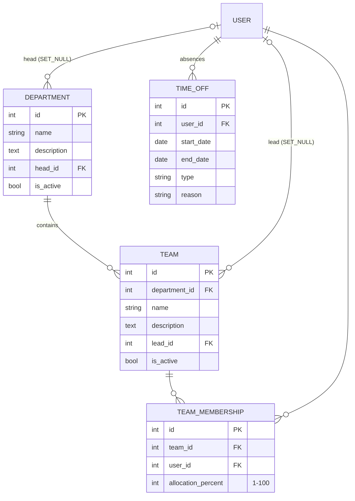

# Team Management Module (`apps/teams`)

This module adds the **organisational layer** to ClientHub: departments, teams,
who sits where, how much of their week each seat consumes, when people are
away, and how much working capacity a team really has. It was added beyond the
original ARCHITECTURE.md app list; everything in it follows the same contract
(§4 relationships, §6 API conventions, §8 permissions, §11 standards).

---

## 1. The five concepts — and how they relate

### Departments
A **department** is a permanent box on the org chart: "Engineering",
"Design", "Sales". Departments change rarely, survive re-orgs in name, and
accumulate history — which is why they are **soft-deleted** (`is_active`
flag), exactly like `Client` and `Project`.

### Teams
A **team** is a working group *inside* a department: "Platform Team" inside
Engineering. The relationship is **1 → N** (one department has many teams; a
team belongs to exactly one department) — a plain `ForeignKey`.

Distinguish this from `ProjectMembership` in the projects app:

| | `ProjectMembership` | `TeamMembership` |
|---|---|---|
| Answers | "who delivers project X?" | "where does this person's *week* go?" |
| Lifetime | as long as the engagement | as long as the org structure |
| Extra data | role on the project | allocation % of the week |

Same M2M-through-table *pattern*, different *business question* — which is why
they are two tables, not one.

### Employee Allocation
**Allocation** is the share of a person's working week promised to a team.
`TeamMembership` is the through table of the `Team ↔ User` many-to-many, and
carries `allocation_percent` (1–100). The core business rule:

> **A person's allocations across all active teams may never exceed 100 %.**

You cannot promise 60 % of someone to Platform and 70 % to Mobile — that's
130 % of a human. The API enforces this on every seat create *and* every
allocation update (and an update excludes its own row, so raising 60 → 80
doesn't count the old 60 against itself). Disbanding a team (soft delete)
frees its members' share automatically, because the sum only counts
`team__is_active=True` rows.

### Availability (TimeOff)
Availability is modelled as its inverse: **recorded absence**. A `TimeOff` row
is a date *range* (`start_date`–`end_date`, inclusive) with a type (vacation,
sick leave, training, personal, other). Ranges — not one row per day — because
that is how people actually request leave, and it compresses storage.

Rules enforced server-side:
- `end_date >= start_date` (serializer 400 + DB `CheckConstraint` backstop);
- **no overlapping entries per person** — overlaps would double-count absence
  days in every capacity report;
- **staff may only record their own absences** — otherwise anyone could book a
  colleague "on vacation" and silently zero their capacity (a griefing vector);
- staff **see only their own rows** (queryset scoping, §8) — a colleague's
  sick-leave history is between them and their manager. Out-of-scope ids 404.

### Capacity Planning
Capacity answers: *how many productive hours does this team actually have in a
given window?* It is **computed, never stored** — a stored number would drift
the moment anyone books a vacation (same rule as project progress %).

The inputs:
1. `User.weekly_capacity_hours` — contracted hours/week (default 40, decimal
   because real contracts land on 37.5 or 20). This lives on the **User**, not
   the team: a part-timer brings a smaller week to *every* team they join.
2. `TeamMembership.allocation_percent` — the team's slice of that week.
3. Workdays in the window (Mon–Fri; weekends never count — public holidays are
   a future refinement needing a holiday-calendar table).
4. `TimeOff` weekdays overlapping the window, **clamped** to it (a 3-week
   vacation only costs the days inside the report window).
5. Logged `TimeEntry` hours (from the projects app) for the same window.

Per member, `GET /api/v1/teams/{id}/capacity/?from=&to=` returns:

```
gross_capacity_hours = weekly × allocation% × workdays ÷ 5
net_capacity_hours   = gross − (daily rate × time-off days × allocation%)
logged_hours         = Σ TimeEntry.hours in the window   (whole person)
utilization_percent  = logged ÷ the PERSON's net capacity (all teams)
```

Two deliberate subtleties:
- **Logged hours can't be split per team** — a `TimeEntry` belongs to a
  project, and projects don't map to teams. So `logged_hours` is the whole
  person's number, and utilization divides by the *person's* net capacity;
  dividing whole-person hours by one team's slice would show 200 % for anyone
  on two teams.
- The whole report costs **three queries** regardless of team size
  (memberships, one grouped TimeEntry aggregate, one TimeOff fetch) — the same
  N+1 discipline as the viewset annotations.

---

## 2. Data model



Field-by-field decisions worth remembering:

- **`Department.head` / `Team.lead` are `SET_NULL`** — a department can be
  temporarily headless; `PROTECT` would block deleting a user over a label.
  The lead is a *pointer*, not a membership role: leads often also sit on
  other teams, and "who leads" must survive membership churn.
- **`Team.department` is `PROTECT`**, and the API additionally refuses to
  soft-delete a department while it still has live teams — you disband or move
  the teams first, so nothing is ever orphaned silently.
- **Conditional unique constraints** (`condition=Q(is_active=True)`): one live
  "Engineering" at a time, one live "Platform" per department — but a
  soft-deleted row frees its name. Same pattern as
  `uniq_project_name_per_client`.
- **`TeamMembership` is CASCADE both ways** — a seat is meaningless without
  either end. `UniqueConstraint(team, user)` makes "add twice" a 400, and a
  DB `CheckConstraint` keeps 1 ≤ allocation ≤ 100 even under racy writes.
- **The ≤ 100 % rule lives in the serializer, not the DB** — a CHECK
  constraint sees one row at a time; rules that span rows belong to the
  application layer (with per-row DB constraints as backstops). Same story for
  time-off overlaps.
- **`TimeOff` uses `DateField`s** — leave is taken in days, never timestamps.
  Hard-deleted: operational rows, like tasks (§4).

---

## 3. API surface

```
/api/v1/departments/              GET list · POST create (mgr/admin)
/api/v1/departments/{id}/         GET · PATCH · DELETE (soft; refused w/ live teams)
/api/v1/departments/{id}/teams/   GET list · POST create   (nested, §6)

/api/v1/teams/                    GET list ?department= &member= &search=
/api/v1/teams/{id}/               GET · PATCH · DELETE (soft)
/api/v1/teams/{id}/members/       GET seats · POST add seat {user_id, allocation_percent}
/api/v1/teams/{id}/capacity/      GET report ?from=YYYY-MM-DD&to=YYYY-MM-DD (mgr/admin)

/api/v1/team-memberships/         GET ?user=7 → one person's allocations everywhere
/api/v1/team-memberships/{id}/    PATCH {allocation_percent} · DELETE   (mgr/admin)

/api/v1/time-off/                 GET ?user=&type=&from_date=&to_date= · POST
/api/v1/time-off/{id}/            GET · PATCH · DELETE (owner or mgr/admin)
```

Conventions carried over from the rest of the codebase:
- **Nesting is one level, read/create only** — writes go flat (§6). Teams are
  created under their department (parent from the URL, immutable after — same
  rule as "a project cannot be moved to another client"; re-orgs are disband +
  recreate, which keeps history honest).
- **PATCH only, PUT 405s** — PUT invites accidental field-blanking.
- **Reads embed mini objects** (`head: {id, name, email}`), **writes accept
  `_id` fields** (`head_id`).
- Writes answer with the **detail shape** (re-queried with annotations) so the
  frontend cache refreshes from the response.
- List numbers (`team_count`, `member_count`, `total_allocation`) are **SQL
  annotations** — one query per page, never per-row Python. A department's
  `member_count` counts DISTINCT people (someone on two of its teams is one
  head).
- `?from_date=&to_date=` on `/time-off/` matches entries **overlapping** the
  window (ends after it opens AND starts before it closes) — the standard
  interval-overlap predicate, the same one used by the overlap validator and
  the capacity report.

### Permission matrix (mirrors §8)

| Capability | ADMIN | MANAGER | STAFF |
|---|:---:|:---:|:---:|
| View departments / teams / seats | ✅ | ✅ | ✅ |
| Create/edit/delete departments & teams | ✅ | ✅ | ❌ |
| Add/remove seats, change allocations | ✅ | ✅ | ❌ |
| Capacity reports | ✅ | ✅ | ❌ (management info, like budgets) |
| Time off | all rows | all rows | **own rows only** (list *and* detail) |
| `User.weekly_capacity_hours` | via /users/ (admin) | — | — |

---

## 4. Beginner mistakes this module deliberately avoids

1. **Storing computed capacity** — it drifts the moment anyone books leave.
   Compute per request from the source rows.
2. **Plain M2M for members** — a bare `ManyToManyField` can't carry
   `allocation_percent`; the through model is what makes allocation possible.
3. **Trusting the client for `user_id`** — the time-off serializer forces
   staff to themselves; "the frontend hides the field" is UX, not security.
4. **Cross-row rules "in the DB somehow"** — CHECKs are single-row; sums and
   overlaps are application-layer with DB backstops for the racy edge.
5. **Floats for hours** — `weekly_capacity_hours` and all report math are
   `Decimal` (§11: money-adjacent numbers are never floats). Note: Python's
   `round()` is *banker's rounding* (31.25 → 31.2) — fine for reports, but
   know it exists.
6. **N+1 reports** — the capacity report batches all three lookups; per-member
   queries would melt on a 30-person team page.
7. **Colliding OpenAPI names** — two apps both define a `UserMiniSerializer`;
   drf-spectacular keys components by class name, so the teams one declares
   `component_name="TeamsUserMini"` or the generated schema silently merges
   them.

## 5. Deliberate scope cuts (future work)

- **Approval workflow for time off** (pending → approved/rejected) — needs
  states, an approver FK and notification hooks; add when HR actually asks.
- **Public-holiday calendars** — workdays are Mon–Fri today; holidays need a
  per-country table.
- **Per-team logged-hours attribution** — would require tagging TimeEntry (or
  Project) with a team; revisit if utilization-by-team becomes a real report.
- **Activity timeline rows** for org changes, once the activities app grows a
  service hook for this module.

## 6. Files

```
backend/apps/teams/
├── models.py        Department, Team, TeamMembership, TimeOff
├── serializers.py   read/write split + the two cross-row validators
├── services.py      allocation budget + capacity report (3-query)
├── filters.py       TeamFilter, TeamMembershipFilter, TimeOffFilter
├── views.py         4 viewsets + capacity action
├── urls.py          departments / teams / team-memberships / time-off
├── admin.py
└── tests/test_teams.py   17 tests: permissions, budget, overlap, math
```

Plus: `accounts` migration `0004_user_weekly_capacity_hours` (exposed on the
admin users API and Django admin), app registered in `config/settings/base.py`
and `config/urls.py`.
